# Free Web Apps

Handy little web apps I build as a hobby and give away for free. Completely free, no ads, no sign-up, and most work offline. A new app is added every day. Each app lives in its own folder with a description and screenshots.

Made by [Muhammad Umar](https://umar8092.github.io/) ([portfolio](https://umar8092.github.io/)).

**All apps:** [umar8092.github.io/apps](https://umar8092.github.io/apps/)

###  [To-Do List](https://umar8092.github.io/apps/offlinetodo/)

A free online to-do list with no registration. Works offline and stays private on your device. Due dates, priorities, sort by due date, search, backup and share.

[**Open the app**](https://umar8092.github.io/apps/offlinetodo/) &middot; [Details and screenshots](offlinetodo/)

<a href="offlinetodo/">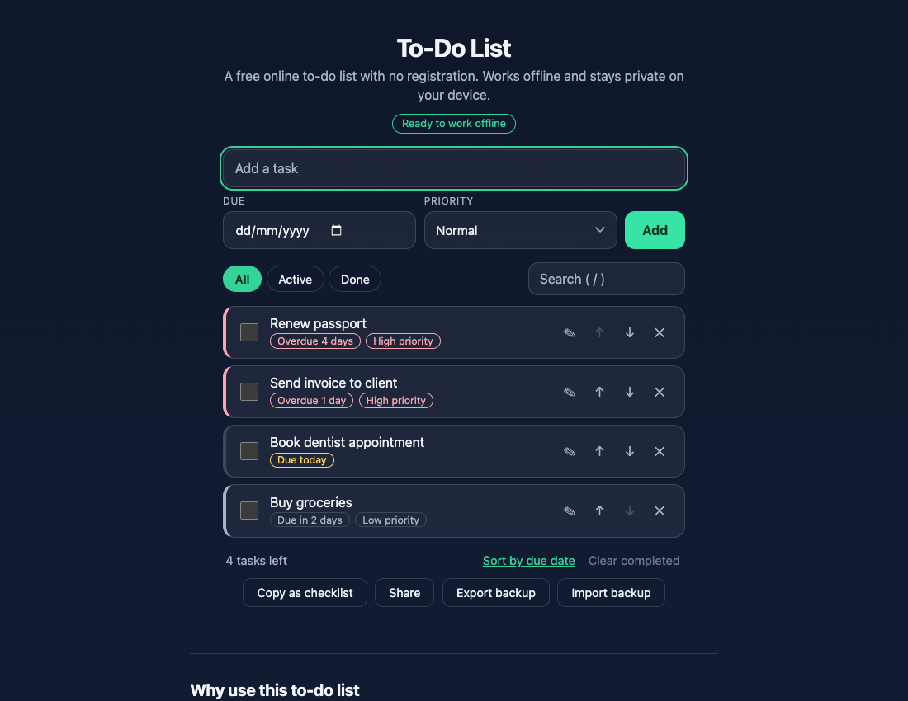</a>

### 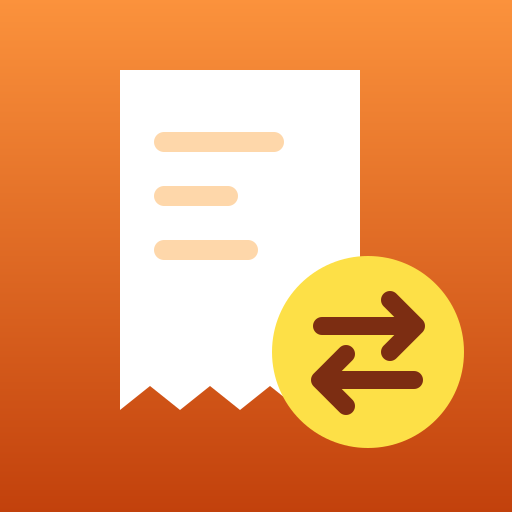 [Bill Splitter](https://umar8092.github.io/apps/bill-splitter/)

Split a bill and see exactly who owes who. Type what each person paid, get the payments between people, and email the summary. Also splits evenly or by order, with tip and tax.

[**Open the app**](https://umar8092.github.io/apps/bill-splitter/) &middot; [Details and screenshots](bill-splitter/)

<a href="bill-splitter/">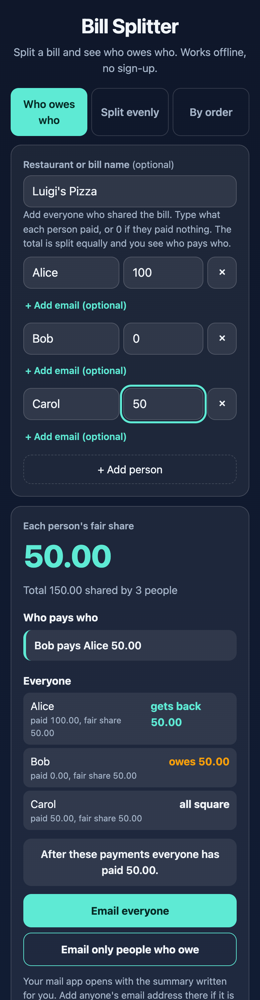</a>

###  [Sleep Cycle Calculator](https://umar8092.github.io/apps/sleepcycle/)

Find the best time to go to bed or wake up using 90-minute sleep cycles.

[**Open the app**](https://umar8092.github.io/apps/sleepcycle/) &middot; [Details and screenshots](sleepcycle/)

<a href="sleepcycle/">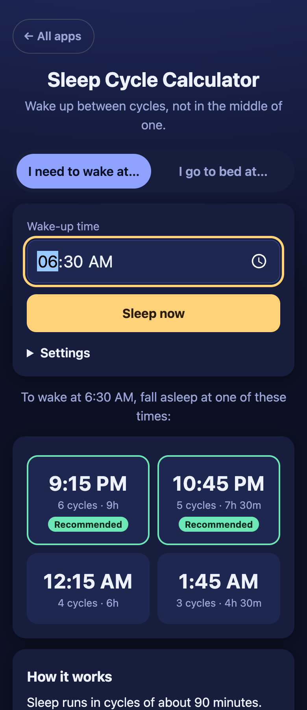</a>

###  [Heartbeat Sound](https://umar8092.github.io/apps/sleepbeat/)

A calming heartbeat sound that loops all night, for sleep, babies and puppies. Keeps playing when the phone screen locks. Adjustable heart rate and sleep timer.

[**Open the app**](https://umar8092.github.io/apps/sleepbeat/) &middot; [Details and screenshots](sleepbeat/)

<a href="sleepbeat/">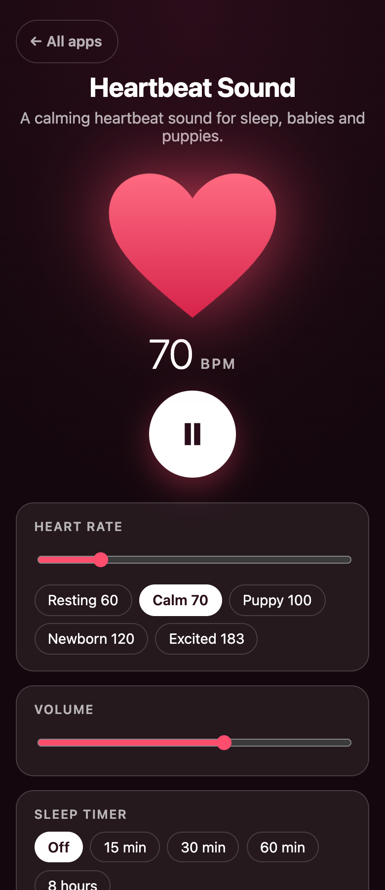</a>

###  [Weather App](https://umar8092.github.io/apps/weather-app/)

Weather forecast for any city or your location, with advice (umbrella? what to wear?), hourly and 7-day forecasts. No sign-up and no API key.

[**Open the app**](https://umar8092.github.io/apps/weather-app/) &middot; [Details and screenshots](weather-app/)

<a href="weather-app/">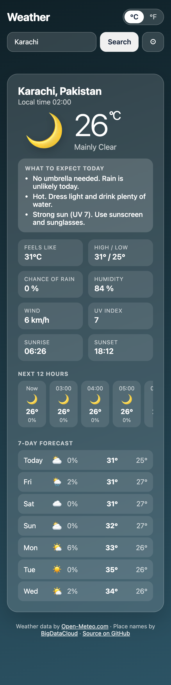</a>

###  [Due Date Calculator](https://umar8092.github.io/apps/due-date-calculator/)

Find your pregnancy due date and how many weeks pregnant you are today from your last period, conception date, IVF transfer or scan. Key dates, email or copy the summary, add the due date to your calendar.

[**Open the app**](https://umar8092.github.io/apps/due-date-calculator/) &middot; [Details and screenshots](due-date-calculator/)

<a href="due-date-calculator/">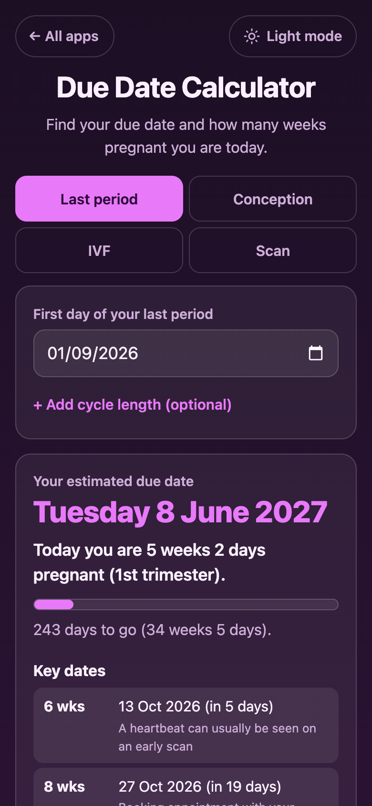</a>

###  [Time Zone Meeting Planner](https://umar8092.github.io/apps/time-zone-meeting-planner/)

Find a meeting time that works across time zones, even when people work different hours (days, evenings or nights). Per-person working hours, custom length up to 3 hours, copy, email and calendar file.

[**Open the app**](https://umar8092.github.io/apps/time-zone-meeting-planner/) &middot; [Details and screenshots](time-zone-meeting-planner/)

<a href="time-zone-meeting-planner/">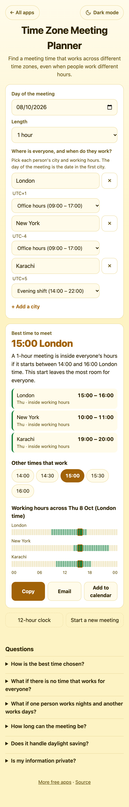</a>

###  [Work Hours Calculator](https://umar8092.github.io/apps/work-hours-calculator/)

Weekly timesheet: type start, finish and break for each day and get total hours, overtime and pay. Night shifts past midnight work, and each day has its own break. Copy, email or print.

[**Open the app**](https://umar8092.github.io/apps/work-hours-calculator/) &middot; [Details and screenshots](work-hours-calculator/)

<a href="work-hours-calculator/">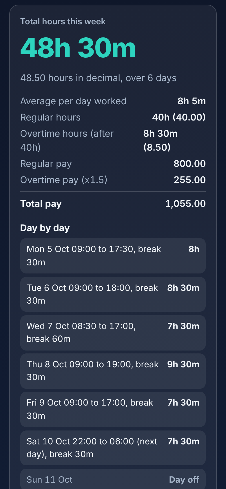</a>

### 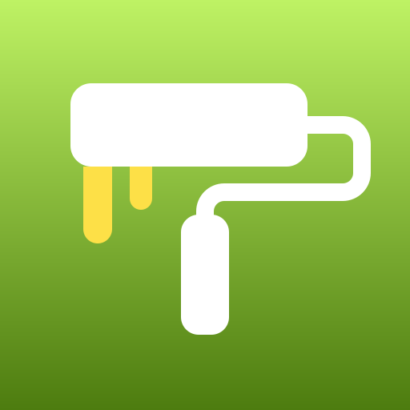 [Paint Calculator](https://umar8092.github.io/apps/paint-calculator/)

Find out how much paint to buy and which tins to pick. Every room has its own size, doors, windows, coats and colour, ceilings are listed separately, and you can email, copy or print the shopping list.

[**Open the app**](https://umar8092.github.io/apps/paint-calculator/) &middot; [Details and screenshots](paint-calculator/)

<a href="paint-calculator/">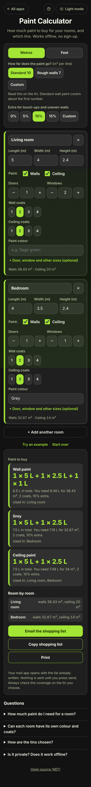</a>

### 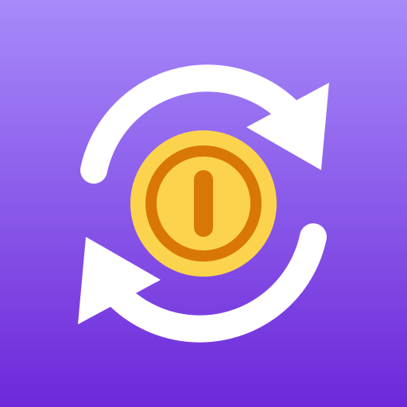 [Subscription Tracker](https://umar8092.github.io/apps/subscription-tracker/)

See what all your subscriptions cost per month and per year, what is due in the next 7 and 30 days, and when free trials end so you can cancel in time. Payment dates move forward by themselves. Calendar reminders, backup, copy and email. Private, no bank link.

[**Open the app**](https://umar8092.github.io/apps/subscription-tracker/) &middot; [Details and screenshots](subscription-tracker/)

<a href="subscription-tracker/">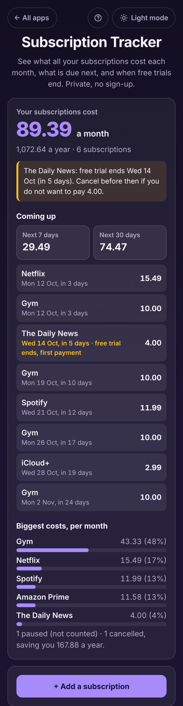</a>

### 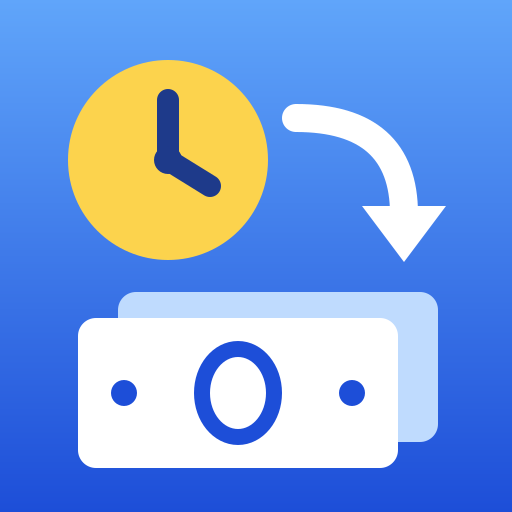 [Hourly to Salary Converter](https://umar8092.github.io/apps/hourly-to-salary-converter/)

Turn any pay into per hour, day, week, 2 weeks, month and year. Counts paid holiday, unpaid days off and overtime, and compares up to 4 job offers to show which really pays more, a year and per hour you actually work. Copy, email or print.

[**Open the app**](https://umar8092.github.io/apps/hourly-to-salary-converter/) &middot; [Details and screenshots](hourly-to-salary-converter/)

<a href="hourly-to-salary-converter/">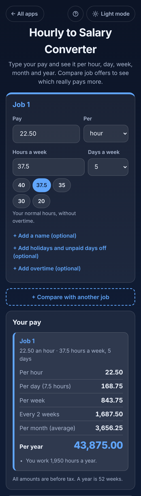</a>

### 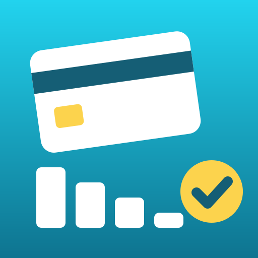 [Loan and Credit Card Payoff Planner](https://umar8092.github.io/apps/loan-and-credit-card-payoff-planner/)

Add your loans and credit cards and see the month you will be debt-free, the total interest, what to pay on each debt this month, and how much sooner you finish by paying a bit more. Compares highest interest first with smallest balance first, warns when a payment never pays a debt off, and shows what to pay to be debt-free in 1 to 5 years. Copy, email or print.

[**Open the app**](https://umar8092.github.io/apps/loan-and-credit-card-payoff-planner/) &middot; [Details and screenshots](loan-and-credit-card-payoff-planner/)

<a href="loan-and-credit-card-payoff-planner/">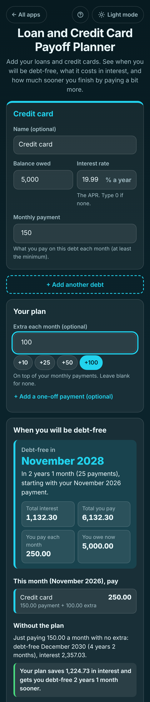</a>

###  [Grocery List with Running Total](https://umar8092.github.io/apps/grocery-list-with-running-total/)

A grocery list with prices for staying on budget. Tick items off as they go in your trolley and see what you have spent, what is still to get, what the whole list costs and what is left of your budget, before you reach the till. Weights, items with no price yet, optional sales tax, paste a whole list, reuse it next week. Copy, email or print.

[**Open the app**](https://umar8092.github.io/apps/grocery-list-with-running-total/) &middot; [Details and screenshots](grocery-list-with-running-total/)

<a href="grocery-list-with-running-total/">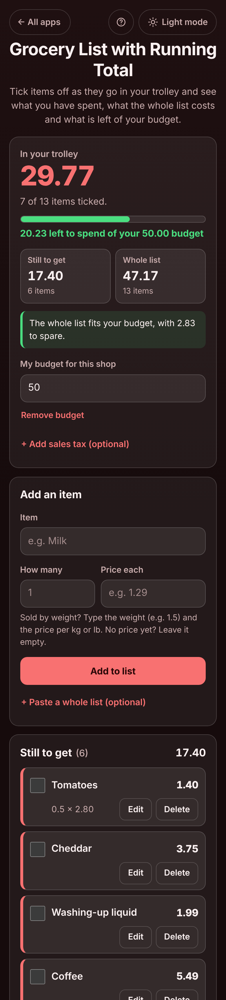</a>

## Adding an app

Create `<name>/index.html` (with its own `favicon.svg`, `icons/`, `screenshots/` and `README.md`). The hub page finds new folders by itself. Also append `{"slug","name","description"}` to `apps.json` as a fallback.

Made by [Muhammad Umar](https://github.com/umar8092). Each app is MIT licensed.
