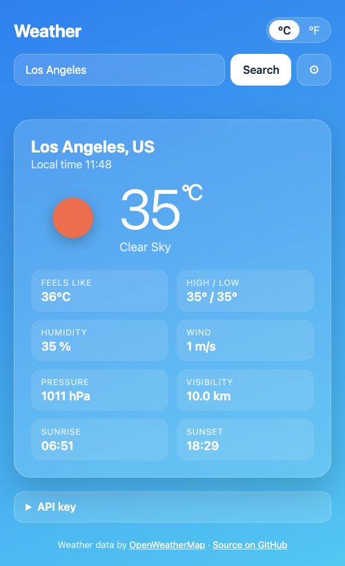

# Free Web Apps

Small, free, private web apps that run in your browser. No ads, no sign-up, and most work offline. Each app lives in its own folder with a description and screenshots.

**All apps:** [umar8092.github.io/apps](https://umar8092.github.io/apps/)

###  [To-Do List](https://umar8092.github.io/apps/offlinetodo/)

A free online to-do list with no registration. Works offline and stays private on your device. Due dates, priorities, search, backup and share.

[**Open the app**](https://umar8092.github.io/apps/offlinetodo/) &middot; [Details and screenshots](offlinetodo/)

###  [Bill Splitter](https://umar8092.github.io/apps/bill-splitter/)

Split a bill and see exactly who owes who. Type what each person paid, get the payments between people, and email the summary. Also splits evenly or by order, with tip and tax.

[**Open the app**](https://umar8092.github.io/apps/bill-splitter/) &middot; [Details and screenshots](bill-splitter/)

###  [Sleep Cycle Calculator](https://umar8092.github.io/apps/sleepcycle/)

Find the best time to go to bed or wake up using 90-minute sleep cycles.

[**Open the app**](https://umar8092.github.io/apps/sleepcycle/) &middot; [Details and screenshots](sleepcycle/)

###  [Heartbeat Sound](https://umar8092.github.io/apps/sleepbeat/)

A calming heartbeat sound that loops all night, for sleep, babies and puppies. Adjustable heart rate and sleep timer.

[**Open the app**](https://umar8092.github.io/apps/sleepbeat/) &middot; [Details and screenshots](sleepbeat/)

###  [Weather App](https://umar8092.github.io/apps/weather-app/)

Current weather for any city or your location, with a background that follows the weather and time of day. Bring your own free OpenWeatherMap key.

[**Open the app**](https://umar8092.github.io/apps/weather-app/) &middot; [Details and screenshots](weather-app/)

## Adding an app

Create `<name>/index.html` (with its own `favicon.svg`, `icons/`, `screenshots/` and `README.md`). The hub page finds new folders by itself. Also append `{"slug","name","description"}` to `apps.json` as a fallback.

Made by [Muhammad Umar](https://github.com/umar8092). Each app is MIT licensed.
