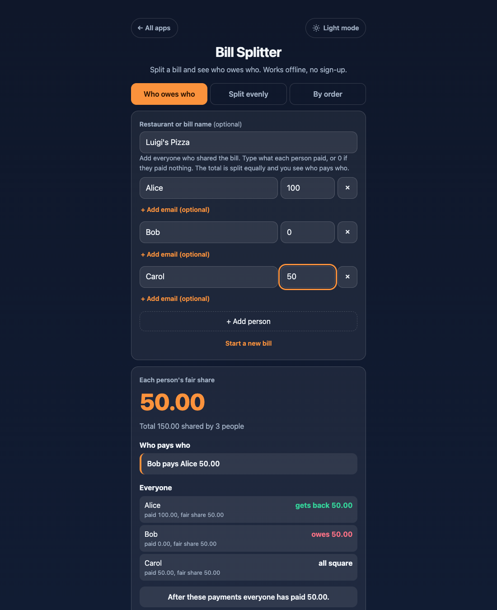
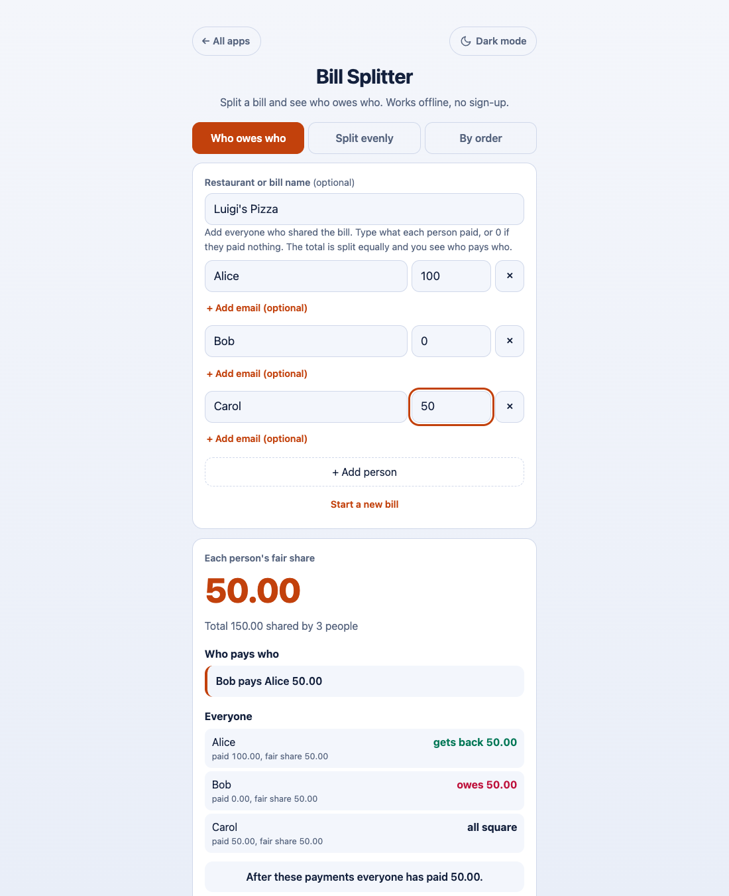

# Bill Splitter

A free **bill splitter that tells you who owes who**. Type what each person paid, and it shows exactly who pays whom so everyone ends up having paid the same. Then open your mail app with the summary already written. It also splits a check evenly, or by what each person ordered with tax and tip shared fairly. Works offline, no sign-up, no ads. No currency is shown, so it works in any country.

**Live demo:** [umar8092.github.io/apps/bill-splitter](https://umar8092.github.io/apps/bill-splitter/)

| Desktop | Light mode | On a phone |
|---|---|---|
|  |  |  |

## The situation it solves

Three friends eat out. Alice pays 100, Bob pays nothing, Carol pays 50. The bill is 150, so each person's fair share is 50. Bill Splitter answers in plain words:

- **Bob pays Alice 50.00.**
- Alice gets back 50.00, Bob owes 50.00, Carol is all square.
- *After these payments everyone has paid 50.00.*

With more people it finds a short list of payments (for example four people, one who paid most, get three payments to that person). Odd cents are shared out so the total is always exact.

## Features

- **Who owes who.** Enter each person's name and what they paid (0 if nothing). Optional bill or restaurant name.
- **Clear summary.** Total, fair share, who pays whom, and what each person paid and owes.
- **Email the summary.** *Email everyone* or *Email only people who owe* opens your mail app with the subject (the bill name), the people, what each paid, who pays whom, and the final result already written. Adding emails is optional: tap *+ Add email* for a person, or leave it and type addresses in your mail app. Nothing is sent by the app. You press send.
- **Copy summary** to paste into any chat.
- **Start a new bill** clears everyone for the next meal, with Undo if you tapped it by mistake.
- **Split evenly** with tip and tax, and **By order** (everyone pays for what they ordered, tax and tip shared in proportion), with a round-up option.
- **Private.** Everything is worked out on your device. Nothing is sent anywhere.
- **Works offline and installable.** Light and dark mode, phone friendly.
- **Back to all apps.** A "← All apps" button at the top of the page.
- **Light and dark mode switch.** It follows your device until you choose, and remembers your choice in every app.

## Run it yourself

No build step and no dependencies.

```bash
git clone https://github.com/umar8092/apps.git
```

Then open `bill-splitter/index.html` in your browser.

Offline mode and install need the files served over `https` or `localhost` (for example `python3 -m http.server`).

## How it works

- `core.js` is the maths, with no page code. All money is whole cents, so shares always add up exactly. `settle()` works out each balance and the payments between people.
- `script.js` builds the page. Names are added as plain text, never as HTML.
- `sw.js` saves the app on your device for offline use.
- Run the checks with `node tests.js`, or open `test.html` in a browser.

## License

[MIT](LICENSE). Free to use, copy, modify and share. Made by [Muhammad Umar](https://github.com/umar8092).
