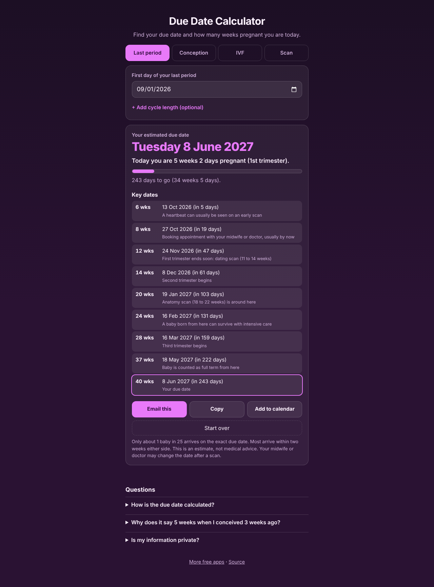
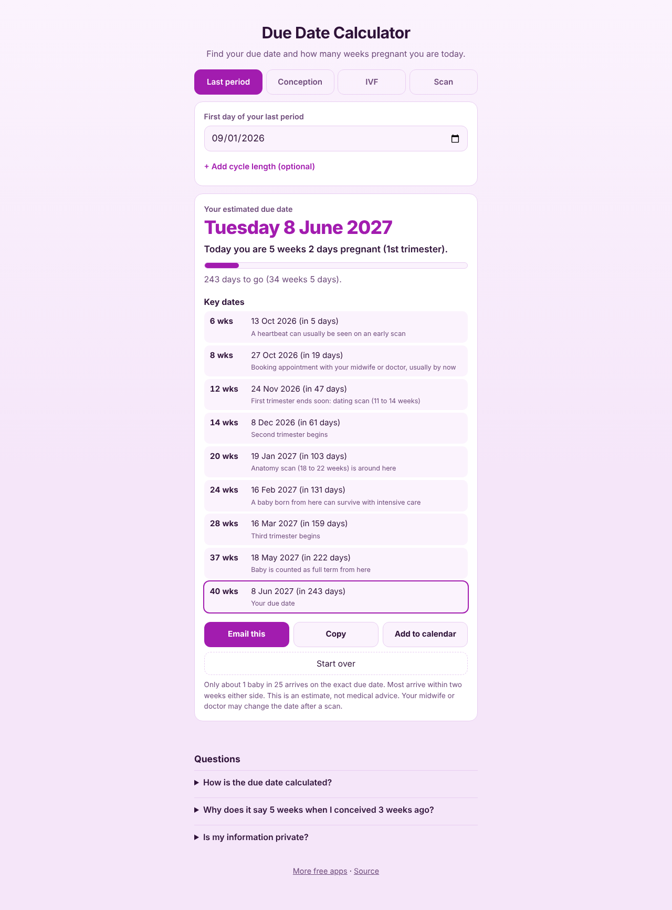

# Due Date Calculator

A free **pregnancy due date calculator** that tells you your due date and exactly how many weeks pregnant you are today. Type the first day of your last period (or the conception date, an IVF transfer date, or an ultrasound result) and get the due date, today's week and day, the trimester, the days left, and the key dates along the way. Email it, copy it, or add the due date to your calendar. Works offline, no sign-up, no ads. Everything stays on your device.

**Live demo:** [umar8092.github.io/apps/due-date-calculator](https://umar8092.github.io/apps/due-date-calculator/)

| Desktop | Light mode | On a phone |
|---|---|---|
|  |  |  |

## The situation it solves

You have just seen a positive test. Your last period started on 1 September 2026 and today is 8 October 2026. You want to know when the baby is due and how far along you are. The app answers in plain words:

- **Your estimated due date: Tuesday 8 June 2027.**
- *Today you are 5 weeks 2 days pregnant (1st trimester).*
- *243 days to go (34 weeks 5 days).*
- Key dates, for example the 12-week scan date (24 Nov 2026) and the 20-week anatomy scan (19 Jan 2027).

## Features

- **Four ways to start.** First day of your last period (with an optional cycle length, behind a small button), conception date, IVF embryo transfer (day 3 or day 5), or an ultrasound scan (date plus the weeks and days it measured).
- **Clear answer.** Due date with the weekday, weeks and days pregnant today, trimester, progress bar and days to go. If the date has passed it says how many days ago.
- **Key dates.** Nine milestones from 6 to 40 weeks with their dates and how many days away they are.
- **Email this.** Opens your mail app with the summary already written. No address needed, you choose who to send it to.
- **Copy** the summary to paste into any chat, and **Add to calendar** to save the due date as an all-day event (`.ics`).
- **Start over** clears everything for a new date, with Undo if you tapped it by mistake.
- **Remembers your date** on your device so it is there next visit.
- **Sensible with odd input.** A date in the future, a blank scan, or a date more than 42 weeks ago gets a clear message instead of a wrong answer.
- **Private, offline and installable.** Light and dark mode, phone friendly. No currency, no ads, no tracking.

## Run it yourself

No build step and no dependencies.

```bash
git clone https://github.com/umar8092/apps.git
```

Then open `due-date-calculator/index.html` in your browser.

Offline mode and install need the files served over `https` or `localhost` (for example `python3 -m http.server`).

## How it works

- A pregnancy is counted as 40 weeks (280 days) from the first day of the last period. The due date is that date plus 280 days, moved by the difference if your cycle is not 28 days.
- From conception it is 266 days. From an IVF transfer it is 261 days (day 5) or 263 days (day 3). From a scan, the measured weeks and days are counted back to day zero.
- `core.js` is the maths with no page code. Dates are whole day numbers, so daylight saving can never shift a result by a day. `script.js` builds the page and writes text with `textContent`.
- `sw.js` saves the app on your device for offline use.
- Run the checks with `node tests.js` (hand-worked examples), open `test.html` in a browser, or run `node ui-test.js` to drive the real page with Playwright.

This is an estimate, not medical advice. Only about 1 baby in 25 is born on the exact due date, and your midwife or doctor may change the date after a scan.

## License

[MIT](LICENSE). Free to use, copy, modify and share. Made by [Muhammad Umar](https://github.com/umar8092).
