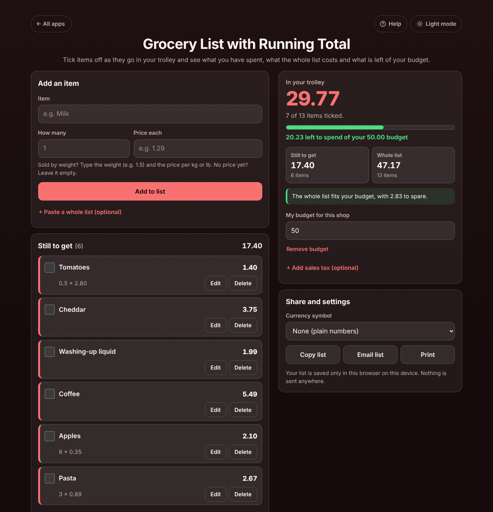

# Grocery List with Running Total

A free **grocery list with prices** for anyone who wants to stay on budget at the supermarket. Type your list (with prices if you know them), then tick each item as it goes in your trolley. The app keeps a **running total** of what is in your trolley, what is **still to get**, what the **whole list** costs and **how much is left of your budget**, and tells you before you reach the till whether everything fits or how much you would have to leave out. Use the same list again next week with one tap. Private on your device: no account, no ads. Works offline, even in a shop with no signal.

**Live demo:** [umar8092.github.io/apps/grocery-list-with-running-total](https://umar8092.github.io/apps/grocery-list-with-running-total/)

| Desktop | On a phone |
|---|---|
|  |  |

## The situation it solves

You have 50.00 for the weekly shop. Adding up prices in your head while pushing a trolley does not work, and finding out at the till that you are over is embarrassing. Example list, typed at home:

| Item | How many | Price each | Line |
|---|---|---|---|
| Milk | 2 | 1.29 | 2.58 |
| Bread | 1 | 1.45 | 1.45 |
| Eggs (12) | 1 | 3.20 | 3.20 |
| Chicken breast | 1 | 6.50 | 6.50 |
| Bananas | 1.2 (kg) | 1.10 per kg | 1.32 |
| Rice 5 kg | 1 | 8.99 | 8.99 |
| Tomatoes | 0.5 (kg) | 2.80 per kg | 1.40 |
| Cheddar | 1 | 3.75 | 3.75 |
| Washing-up liquid | 1 | 1.99 | 1.99 |
| Coffee | 1 | 5.49 | 5.49 |
| Apples | 6 | 0.35 | 2.10 |
| Pasta | 3 | 0.89 | 2.67 |

Before you leave: **Whole list 41.44. The whole list fits your budget, with 8.56 to spare.**

In the shop you tick the first six items, the chicken is 7.25 on the shelf instead of 6.50 (tap **Edit**, change it), and you add 2 bars of chocolate at 2.49 that were not on the list. The app now says:

- **In your trolley: 29.77** (2.58 + 1.45 + 3.20 + 7.25 + 1.32 + 8.99 + 4.98), 7 of 13 items ticked.
- **20.23 left to spend of your 50.00 budget**, with a bar 59.5% full.
- **Still to get: 17.40** (6 items) and **Whole list: 47.17**.
- **The whole list fits your budget, with 2.83 to spare.**

Then a bottle of wine at 8.99 goes on the list: **The whole list is 6.16 over your budget. Leave out items worth 6.16 or more.** If everything ends up in the trolley anyway, the budget line turns red: **6.16 over your 50.00 budget**.

Next week, tap **New shop with the same list**: every item and price stays, all ticks are cleared.

Other cases it handles: items with no price yet (counted, with a warning that the real total will be higher), loose fruit by weight (1.2 at 1.10 = 1.32, each line rounded to the cent like a till receipt), the same item added twice (adds to its quantity instead of a second line, with Undo; a different price gets its own line), optional sales tax added at the till (8.875% on 41.44 = 3.68), prices typed or pasted as `1,29`, `$1,299.00` or `1.299,00 €`, a 0.00 free item, and quantities of 0, negative or over 999, negative, huge or word prices, a blank item or a budget of 0 (each refused with a plain message). Very long names wrap inside their box. Corrupt or edited saved data is cleaned up (bad rows dropped), and if the browser blocks storage the app still works and says the list is not being saved. Money is kept in whole cents and quantities in thousandths, so totals are exact.

## Features

- **Help button.** Tap **Help** at the top for a short how-to, and **All apps** to go back to the list of apps. **Light mode / Dark mode** switch.
- **Each item in its own box** with a big tick box, the line total, and the quantity times the price. Ticked items move to **In the trolley**, struck through, and back again if you untick them.
- **Three totals:** **In your trolley** (what you pay at the till now), **Still to get** and **Whole list**, plus a running total on each list heading so you see it while scrolling.
- **Budget (optional)**, behind *+ Set a budget (optional)*: a bar, how much is left to spend or how much you are over, and whether the whole list fits.
- **Sales tax (optional)**, behind *+ Add sales tax (optional)*, for places where tax is added at the till.
- **Sold by weight:** type the weight as the quantity and the price per kg or lb.
- **Paste a whole list** (optional): one item per line, `2 x Milk 1.29` becomes 2 milk at 1.29. Pasting several lines into the Item box opens it by itself.
- **Edit** in place (Enter saves, Escape cancels) and **Delete** with **Undo** right where the item was.
- **New shop with the same list** and **Delete all items**, both with Undo.
- **Currency symbol** (none, $, €, £, ₹, Rs, ¥, ₩, ₦, ₱, R, kr, CHF, AED, SAR, RM), remembered. Plain numbers by default.
- **Copy list**, **Email list** (opens your mail app with the list written and no address needed) and **Print**.
- **Try an example list** to see how it works before typing anything.
- **Private, works offline and installable.** Phone and desktop layouts. Works with a keyboard (Enter adds an item and goes back to the Item box, Space ticks) and a screen reader.

## Run it yourself

No build step and no dependencies.

```bash
git clone https://github.com/umar8092/apps.git
```

Then open `grocery-list-with-running-total/index.html` in your browser. Offline mode and install need the files served over `https` or `localhost` (for example `python3 -m http.server`).

## How it works

- `core.js` is the maths, with no page code. Money is whole cents and quantities are whole thousandths. Each line is rounded half up to the cent, the lines are added up, and tax (if set) is worked out on the total.
- `script.js` builds the page. Everything you type is added as plain text, never as HTML. The list is saved in this browser's storage under `grocery-list-with-running-total.state`.
- `sw.js` saves the app for offline use (network first, so updates always arrive).
- Checks: `node tests.js` for the maths (also `test.html` in a browser), `node ui-test.js` drives the real page in headless Chromium (add `--base https://umar8092.github.io/apps` to test the live site).

## License

[MIT](LICENSE). Free to use, copy, modify and share. Made by [Muhammad Umar](https://github.com/umar8092).
