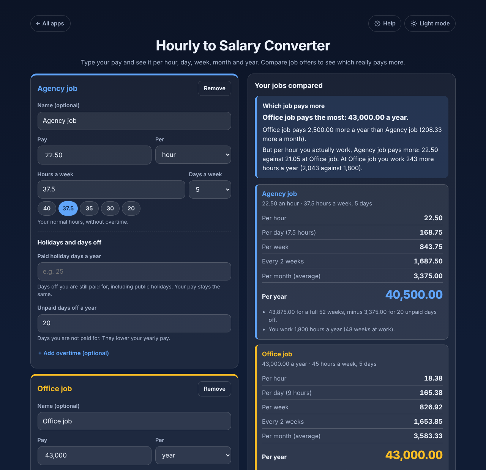

# Hourly to Salary Converter

A free **hourly to salary converter** for job seekers and workers. Type your pay per hour, day, week, 2 weeks, month or year and see all the others. Add **paid holiday**, **unpaid days off** and **overtime**, and **compare up to 4 job offers** side by side: it tells you which one pays more a year and a month, and which pays more **per hour you actually work**. Private on your device: no account, no ads. Works offline.

**Live demo:** [umar8092.github.io/apps/hourly-to-salary-converter](https://umar8092.github.io/apps/hourly-to-salary-converter/)

| Desktop | On a phone |
|---|---|
|  |  |

## The situation it solves

You have two job offers. One pays by the hour with no holiday pay, the other is a salary with longer hours and paid holiday. Which one really pays more? Converters that only multiply by 2,080 can't answer that.

| | Agency job | Office job |
|---|---|---|
| Pay | 22.50 an hour | 43,000 a year |
| Hours a week | 37.5, 5 days | 45, 5 days |
| Paid holiday days a year | 0 | 33 (25 + 8 public holidays) |
| Unpaid days off a year | 20 (4 weeks) | 0 |

The answer:

- **Agency job:** 22.50 an hour, 168.75 a day (7.5 hours), 843.75 a week, 1,687.50 every 2 weeks, **3,375.00 a month, 40,500.00 a year**. That is 43,875.00 for a full 52 weeks (22.50 × 37.5 × 52), minus 3,375.00 for the 20 unpaid days. You work 1,800 hours a year (48 weeks).
- **Office job:** 18.38 an hour, 165.38 a day, 826.92 a week, 1,653.85 every 2 weeks, **3,583.33 a month, 43,000.00 a year**. You work 2,043 hours a year (45.4 weeks), so **21.05 per hour you actually work**.
- **Which job pays more:** *Office job pays 2,500.00 more a year than Agency job (208.33 more a month). But per hour you actually work, Agency job pays more: 22.50 against 21.05 at Office job. At Office job you work 243 more hours a year (2,043 against 1,800).*

Simpler questions get a plain answer too. **20 an hour at 40 hours** is 800.00 a week, 3,466.67 a month and **41,600.00 a year**. **45,000 a year at 40 hours** is **21.63 an hour**.

Overtime is added only in the weeks you are at work. For example, 20 an hour, 40 hours plus 5 overtime hours at 1.5 times, with 10 paid holiday days, gives 950.00 a week and 49,100.00 a year (41,600 + 50 weeks × 150).

Other cases it handles: pay typed or pasted as `22,50`, `45,000`, `$ 45,000.00` or `45.000,00 €`; zero pay; blank, negative, word or over 100,000,000 pay (a plain message under the box); 0 or over 168 hours; half days off (2.5); quarter days or more days off than the year (refused); a whole year unpaid; overtime that would pass 168 hours; overtime rates from 1 to 5 times; an unfinished job (left out of the comparison until it is filled in); jobs that pay the same; long job names; and corrupt or edited saved data (bad values are dropped and the app starts clean). Every amount is worked out as an exact fraction and rounded to the cent once, so the totals match hand sums.

## Features

- **Help button.** Tap **Help** at the top for a short how-to, and **All apps** to go back to the list of apps. **Light mode / Dark mode** switch.
- **Any pay in, every pay out:** per hour, per day, per week, every 2 weeks, per month (average) and per year. It updates as you type.
- **Hours a week** with quick buttons (40, 37.5, 35, 30, 20) and **Days a week** (1 to 7), for full-time, part-time and 4-day weeks.
- **Optional extras**, hidden until you need them: **+ Add a name**, **+ Add holidays and unpaid days off** (paid holiday days and unpaid days off) and **+ Add overtime** (hours a week at 1.25, 1.5 or 2 times, or your own rate).
- **Compare with another job:** up to 4 jobs, each in its own coloured box with its own hours, days, holidays and overtime. **Which job pays more** gives the difference per year and per month, and points out when the other job pays more per hour you actually work.
- **Remove** a job and **Start over**, each with **Undo**.
- **Currency symbol** (none, $, €, £, ₹, Rs, ¥, ₩, ₦, ₱, R, kr, CHF, AED), remembered. Plain numbers by default.
- **Copy results**, **Email results** (opens your mail app with the summary written and no address needed) and **Print**.
- **Try an example: compare two job offers** button on the empty page.
- **Private, works offline and installable.** Phone and desktop layouts.

## Run it yourself

No build step and no dependencies.

```bash
git clone https://github.com/umar8092/apps.git
```

Then open `hourly-to-salary-converter/index.html` in your browser. Offline mode and install need the files served over `https` or `localhost` (for example `python3 -m http.server`).

## How it works

- `core.js` is the maths, with no page code. Money is whole cents, hours are hundredths and days off are half days. Each result is an exact fraction (BigInt) rounded half up once. A year is 52 weeks: unpaid days off lower the year, paid holiday lowers only the hours you work, and overtime counts only in the weeks you are at work.
- `script.js` builds the page. Everything you type is added as plain text, never as HTML. Your jobs are saved in this browser's storage under `hourly-to-salary-converter.state`.
- `sw.js` saves the app for offline use (network first, so updates always arrive).
- Checks: `node tests.js` for the maths (also `test.html` in a browser), `node ui-test.js` drives the real page in headless Chromium (add `--base https://umar8092.github.io/apps` to test the live site).

## License

[MIT](LICENSE). Free to use, copy, modify and share. Made by [Muhammad Umar](https://github.com/umar8092).
