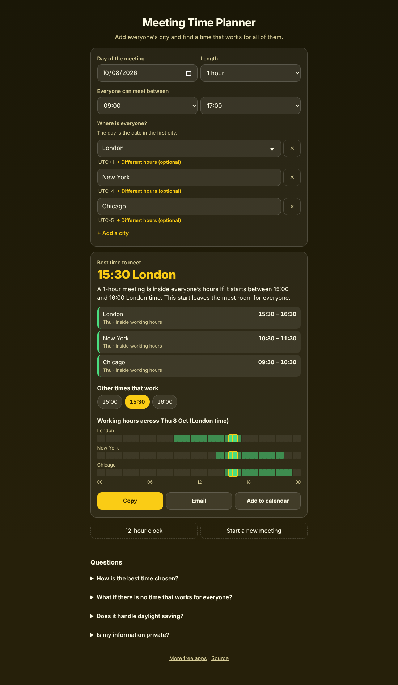
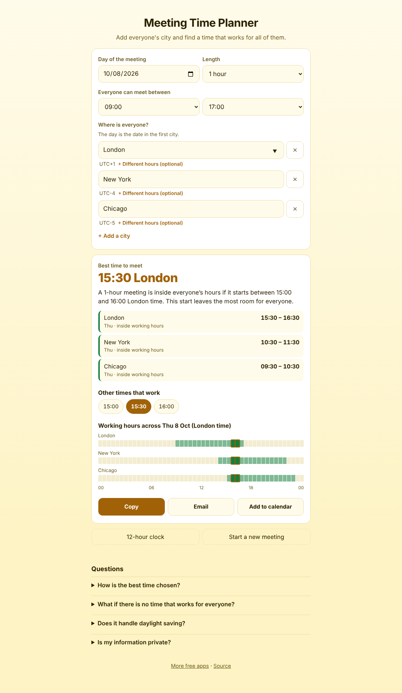
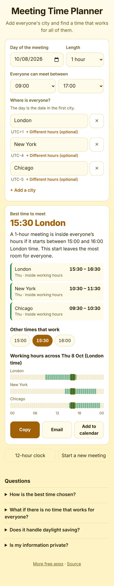

# Meeting Time Planner

A free **meeting time planner for people in different time zones**. Add everyone's city and it tells you the best time to meet inside everyone's working hours, with each person's local time and day. Daylight saving is handled by using each city's real clock on the day you pick. Copy the result, email it, or add it to your calendar. Works offline, no sign-up, no ads, nothing leaves your device.

**Live demo:** [umar8092.github.io/apps/meeting-time-planner](https://umar8092.github.io/apps/meeting-time-planner/)

| Desktop | Light mode | On a phone |
|---|---|---|
|  |  |  |

## The situation it solves

A team lead in London needs a one-hour call with colleagues in New York and Chicago on Thursday 8 October 2026, with everyone meeting between 09:00 and 17:00. The app answers in plain words:

- **Best time: 15:30 London.**
- That is **10:30 in New York** and **09:30 in Chicago**, all on Thursday, all inside working hours.
- Any start from 15:00 to 16:00 London time also works, and the chips let you pick another.

Add Mumbai on top and the app says **no time works for everyone**, then shows the closest option and who has to meet outside their hours, and by how long.

## Features

- **Best time, not just a converter.** Tries every half hour and keeps only times where the whole meeting is inside everyone's hours, then picks the one with the most room for the person with the least.
- **Each person's local time and day**, including "next day" and "previous day", and a note when it is a weekend somewhere.
- **No overlap? It says so** and shows the closest option with the minutes outside working hours.
- **Hours per city** with *+ Different hours (optional)*; meeting length from 30 minutes to 3 hours; 12 or 24-hour clock.
- **Daylight saving** is correct for the chosen day, even when two places change their clocks on different dates.
- **Copy, email, calendar.** *Email* opens your mail app with the plan written (no recipient needed). *Add to calendar* saves a `.ics` file in UTC, so everyone sees it in their own time zone.
- **Start a new meeting** clears everything, with Undo. Your last plan is remembered on this device.
- **Private, offline and installable.** Light and dark mode, phone friendly.

## Run it yourself

No build step and no dependencies.

```bash
git clone https://github.com/umar8092/apps.git
```

Then open `meeting-time-planner/index.html` in your browser.

Offline mode and install need the files served over `https` or `localhost` (for example `python3 -m http.server`).

## How it works

- `core.js` is the maths, with no page code. Time zone rules come from the browser's built-in `Intl` database, so no data is downloaded. `plan()` tries every half hour of the day in the first city.
- `script.js` builds the page. Typed text is added as plain text, never as HTML.
- `sw.js` saves the app on your device for offline use.
- Run the checks with `node tests.js` (hand-worked examples), or open `test.html` in a browser.

## License

[MIT](LICENSE). Free to use, copy, modify and share. Made by [Muhammad Umar](https://github.com/umar8092).
