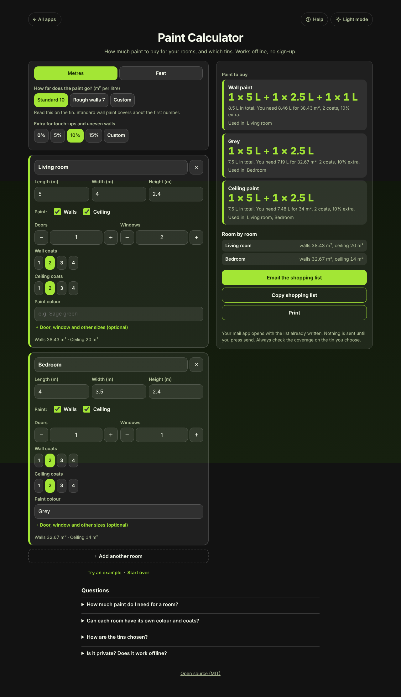

# Paint Calculator

A free **paint calculator that tells you how much paint to buy and which tins to pick**. Add your rooms, and give each one its own size, doors, windows, coats and colour. You get a shopping list such as *1 × 5 L + 1 × 2.5 L*, with ceilings listed separately. Email, copy or print the list. Works offline, no sign-up, no ads. No currency is shown, so it works in any country.

**Live demo:** [umar8092.github.io/apps/paint-calculator](https://umar8092.github.io/apps/paint-calculator/)

| Desktop | On a phone |
|---|---|
|  |  |

## The situation it solves

You are repainting your living room (5 × 4 m, 2.4 m high, 1 door, 2 windows) and your bedroom (4 × 3.5 m, 2.4 m high, 1 door, 1 window). The bedroom walls are grey, both ceilings are white, everything gets 2 coats, and the tin says 10 m² per litre. How many tins do you buy?

- Living room walls: 18 m around × 2.4 m = 43.2 m², minus the door (1.89) and two windows (2.88) = **38.43 m²**. With 2 coats and 10% extra you need 8.46 L, so buy **1 × 5 L + 1 × 2.5 L + 1 × 1 L** (8.5 L).
- Grey bedroom walls: 36 − 1.89 − 1.44 = **32.67 m²**, needs 7.19 L, so buy **1 × 5 L + 1 × 2.5 L**.
- Ceiling paint for both rooms: 20 + 14 = 34 m², needs 7.48 L, so buy **1 × 5 L + 1 × 2.5 L**.

## Features

- **Help button.** Tap **Help** at the top for a short how-to, and tap **All apps** to go back to the list.
- **Each room has its own settings:** size, doors, windows, wall coats, ceiling coats, and whether to paint walls, ceiling or both.
- **Colours.** Name a colour per room (optional). Rooms with the same colour are added together so you buy once.
- **Door and window sizes** can be changed, and you can take off areas (a wardrobe) or add areas (a chimney breast), all optional.
- **Tins to buy.** The smallest total that covers what you need; a bigger tin is suggested when it wastes at most about a litre (a quart) more.
- **Metres or feet**, with your numbers converted when you switch. Coverage presets and a custom value, and 0 to 15% extra or your own.
- **Email, copy or print** the shopping list. Email opens your mail app with no address needed.
- **Start over** with Undo, and **Try an example**.
- **Private, offline and installable.** Rooms stay on your device.
- **Back to all apps** button and a **light and dark mode switch** that remembers your choice in every app.

## Run it yourself

No build step and no dependencies.

```bash
git clone https://github.com/umar8092/apps.git
```

Then open `paint-calculator/index.html` in your browser.

Offline mode and install need the files served over `https` or `localhost` (for example `python3 -m http.server`).

## How it works

- `core.js` is the maths, with no page code. Lengths are whole thousandths and paint is whole millilitres (or fluid ounces), so results are exact. `plan()` works out the paints to buy and `bestCans()` picks the tins.
- `script.js` builds the page. User text is added as plain text, never as HTML.
- `sw.js` saves the app on your device for offline use (network first, so updates arrive straight away).
- Run the checks with `node tests.js`.

## License

[MIT](LICENSE). Free to use, copy, modify and share. Made by [Muhammad Umar](https://github.com/umar8092).
