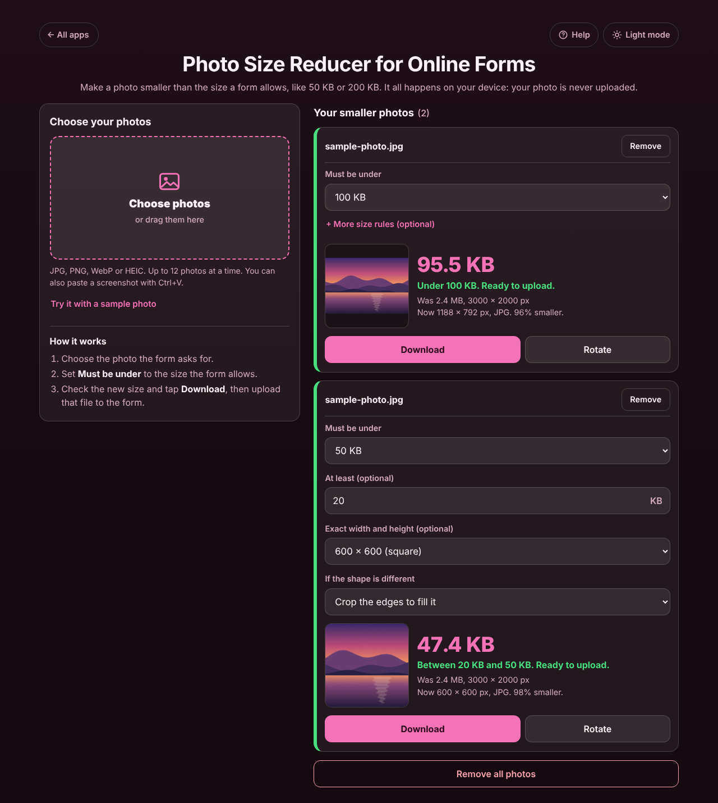
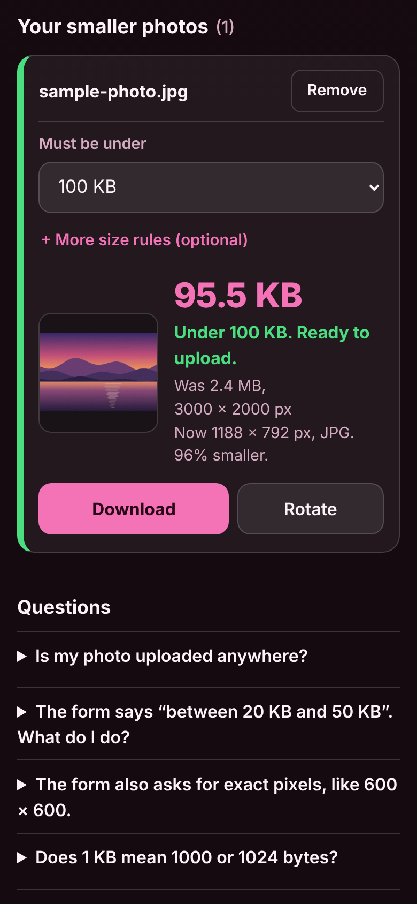

# Photo Size Reducer for Online Forms

A free **photo size reducer** for anyone filling in an online form that says *"Photo: JPG, max 100 KB"*: job and exam applications, visa and passport forms, university admissions, ID uploads. Choose the photo, set **Must be under** to the size the form allows (20 KB, 50 KB, 100 KB, 200 KB, 500 KB, 1 MB, 2 MB or any size you type), and get a JPG that is as sharp as it can be while staying under that size, ready to download and upload. Forms that also ask for a **minimum size** ("between 20 KB and 50 KB") or **exact pixels** ("600 × 600") are handled too. Everything happens **on your device**: the photo is never uploaded anywhere, which matters for ID cards and documents. No account, no ads, works offline.

**Live demo:** [umar8092.github.io/apps/photo-size-reducer-for-online-forms](https://umar8092.github.io/apps/photo-size-reducer-for-online-forms/)

| Desktop | On a phone |
|---|---|
|  |  |

## The situation it solves

Ayesha is applying for a job online. The form says **"Photograph: JPG, under 100 KB"** and **"Signature: between 10 KB and 20 KB"**. The photo on her phone is **2.4 MB, 3000 × 2000 pixels**, and the upload button keeps saying *file too large*. She does not want to upload her photo and ID to a random website just to shrink it.

She taps **Choose photos**, picks the photo, and leaves **Must be under** on **100 KB**. A second later the box shows:

- **95.5 KB** (97,859 bytes)
- **Under 100 KB. Ready to upload.**
- *Was 2.4 MB, 3000 × 2000 px. Now 1188 × 792 px, JPG. 96% smaller.*

She taps **Download** and gets `IMG_1234-under-100KB.jpg`, then uploads it to the form.

For the signature she adds a second photo, sets **Must be under** to **20 KB**, taps **+ More size rules (optional)** and types **10** in **At least**. The box says **Between 10 KB and 20 KB. Ready to upload.** Each photo keeps its own rules, so both sit side by side.

Other sizes for the same 3000 × 2000 photo (Chrome on a laptop; other browsers differ by a few KB but always stay under the limit):

| Must be under | Result | Pixels |
|---|---|---|
| 20 KB | 19 KB (19,533 bytes) | 750 × 500 |
| 50 KB | 47.1 KB (48,315 bytes) | 840 × 560 |
| 100 KB | 95.5 KB (97,859 bytes) | 1188 × 792 |
| 200 KB | 188 KB (193,265 bytes) | 1500 × 1000 |
| 1 MB | 935 KB (958,010 bytes) | 2552 × 1701 |

If a form wants **exact pixels**, for example a 600 × 600 passport-style photo, pick **600 × 600 (square)** under **Exact width and height**. **Crop the edges to fill it** cuts a little off the sides; **Add white bars, keep the whole photo** keeps all of it.

Other cases it handles:

- **1000 or 1024?** Websites count KB differently, so *under 100 KB* is made at most 100,000 bytes and *at least 20 KB* at least 20,480 bytes. It passes either way.
- **A photo that already fits** (a JPG under the limit, nothing else asked) is left exactly as it is: *Already under 100 KB, so it is left exactly as it is.*
- **A photo too small for the minimum** (a tiny signature scan) is padded with empty space inside the file that does not change the picture, so it reaches the minimum.
- **Impossible limits** (a 3000 × 3000 pixel photo under 2 KB) say so plainly: *This photo cannot be made under 2 KB and still be recognisable. Check the limit, or choose a bigger one.*
- **Sideways photos**: phone photos come out the right way up, and **Rotate** turns any photo a quarter turn.
- **PNG with a see-through background** becomes a JPG with white behind it. **HEIC** (iPhone) photos open in Safari; other browsers that cannot open them get clear advice instead of an error. **PDFs, text files, empty or damaged files** each get a plain message.
- **Typing mistakes** in the size boxes (blank, 0, negative, words, over 50 MB, "At least" bigger than the limit, a width without a height) are refused with a message under the box, and the Download button is hidden until it is fixed. Pasted values like `30kb`, `1,5` or `2 MB` are understood.
- Up to 12 photos at a time, very long file names wrap inside their box, and if the browser blocks storage the app still works (it just does not remember your size limit).

## Features

- **Help button.** Tap **Help** at the top for a short how-to, and **All apps** to go back to the list of apps. **Light mode / Dark mode** switch.
- **Choose photos**, drag them onto the box, or paste a screenshot with Ctrl+V. **Try it with a sample photo** to see how it works first.
- **Each photo in its own box** with its own **Must be under** limit (presets from 20 KB to 2 MB, or **Other size** in KB or MB), a preview, the new size in big type, and a green line when it is ready to upload.
- **+ More size rules (optional):** **At least** a minimum size, **Exact width and height** in pixels (600 × 600, 413 × 531 passport 35 × 45 mm, 1200 × 1200, or your own), and crop or white bars when the shape differs.
- **Keeps the photo sharp:** lowers the quality a little first and makes the picture smaller in pixels only as much as it has to.
- **Download** with a clear file name (`photo-under-100KB.jpg`), and **Share or save** on phones that support it (save to Photos, send in a chat).
- **Rotate**, **Remove** with **Undo**, and **Remove all photos** with **Undo**.
- **Remembers your last size rules** for the next photo and the next visit. Photos themselves are never stored.
- **Private, works offline and installable.** Phone and desktop layouts. Works with a keyboard and a screen reader.

## Run it yourself

No build step and no dependencies.

```bash
git clone https://github.com/umar8092/apps.git
```

Then open `photo-size-reducer-for-online-forms/index.html` in your browser. Offline mode and install need the files served over `https` or `localhost` (for example `python3 -m http.server`).

## How it works

- `core.js` holds the rules with no page code: reading the sizes people type, the byte limits (1000 for "under", 1024 for "at least"), the crop and white-bar maths, and the search. The search encodes the photo as JPG at high quality first; if it is too big it finds the highest quality that fits (never below a sensible floor), and only then makes the picture smaller in pixels and tries again. A minimum is reached by raising the quality, or else by adding empty JPEG comment blocks, which leave the picture untouched.
- `script.js` builds the page. The browser decodes the photo (turned the right way up), draws it on a canvas and saves it as JPG with `canvas.toBlob`. Photos are handled one at a time so phones do not run out of memory. File names are shown as plain text, never as HTML. Only your size rules are saved, in this browser's storage under `photo-size-reducer-for-online-forms.rules`.
- `sw.js` saves the app for offline use (network first, so updates always arrive).
- Checks: `node tests.js` for the rules and the search with a pretend encoder (also `test.html` in a browser), and `node ui-test.js` drives the real page in headless Chromium with real photos, downloads, odd files, every screen size and both themes (add `--base https://umar8092.github.io/apps` to test the live site).

## License

[MIT](LICENSE). Free to use, copy, modify and share. Made by [Muhammad Umar](https://github.com/umar8092).
