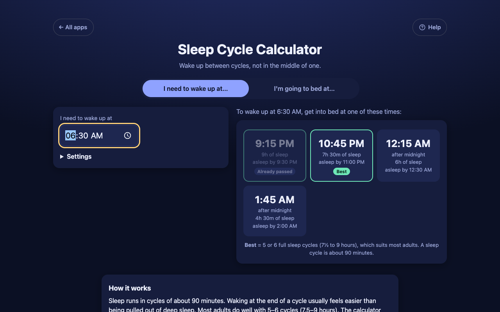

# Sleep Cycle Calculator

A free **sleep cycle calculator** that tells you the best time to go to bed or wake up. Sleep runs in cycles of about 90 minutes, and waking at the end of a cycle usually feels easier than being pulled out of deep sleep. No ads, no sign-up, works offline.

**Live demo:** [umar8092.github.io/apps/sleepcycle](https://umar8092.github.io/apps/sleepcycle/)

| Desktop | On a phone |
|---|---|
|  |  |

## The situation it solves

You must wake at 6:30 AM. Sleep Cycle Calculator tells you when to **get into bed**: **9:15 PM** (6 cycles, 9 hours of sleep, asleep by 9:30 PM), **10:45 PM** (5 cycles, 7 hours 30 minutes, asleep by 11:00 PM), 12:15 AM (4 cycles, 6 hours) or 1:45 AM (3 cycles, 4 hours 30 minutes). Times marked **Best** give 5 or 6 full cycles. Times that have already passed are faded and marked "Already passed", so you only pick one you can still make.

## Features

- **Help button.** Tap **Help** at the top for a short how-to written for this app, and tap **All apps** to go back to the list.
- **I need to wake up at...** gives the times to get into bed. **I'm going to bed at...** gives the times to set your alarm, and **Use the time now** fills in the current time. Each card shows the hours of sleep and when you will be asleep.
- A nap tip: about 20 minutes, or a full 90-minute cycle, avoids waking in deep sleep.
- Settings: minutes to fall asleep, cycle length (default 90), and 12 or 24 hour clock. They are remembered on your device.
- Works offline and installable. Private: nothing leaves your device.
- **Back to all apps.** A "← All apps" button at the top of the page.

## Run it yourself

```bash
git clone https://github.com/umar8092/apps.git
```

Then open `sleepcycle/index.html` in your browser.

## License

[MIT](LICENSE). Free to use, copy, modify and share. Made by [Muhammad Umar](https://github.com/umar8092).

Sleep times are a general guide, not medical advice.
