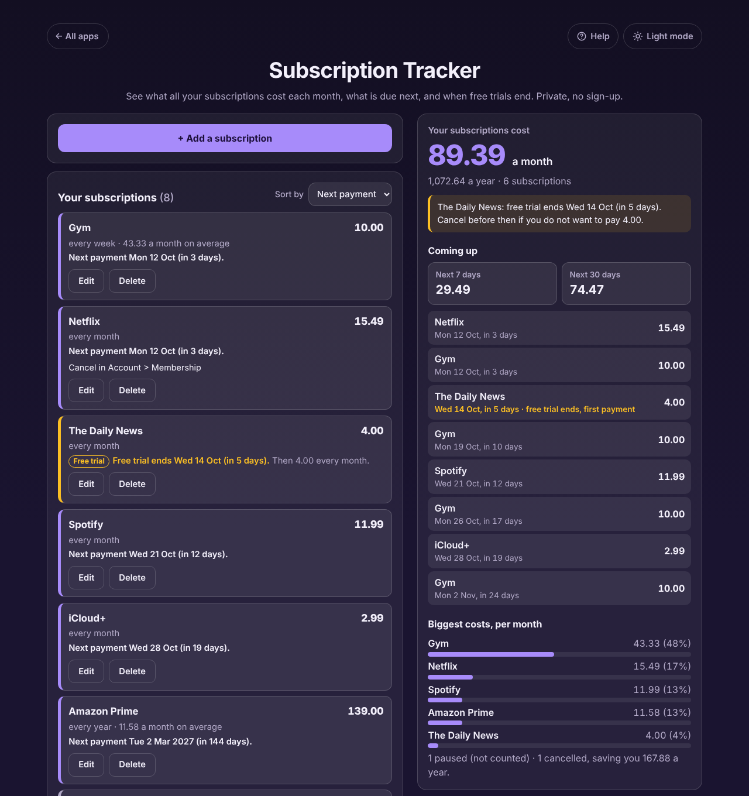

# Subscription Tracker

A free **subscription tracker** for anyone paying for streaming, music, apps, cloud storage, a gym, a phone plan or newspapers. Add each subscription once and see what they all cost **per month and per year**, what is **due in the next 7 and 30 days**, which ones cost the most, and when a **free trial ends** so you can cancel in time. Payment dates move forward by themselves, so the list is right every time you open it. Private on your device: no account, no bank link, no ads. Works offline.

**Live demo:** [umar8092.github.io/apps/subscription-tracker](https://umar8092.github.io/apps/subscription-tracker/)

| Desktop | On a phone |
|---|---|
|  |  |

## The situation it solves

Payments for subscriptions trickle out on different days, some weekly, some monthly, one yearly, and a free trial quietly turns into a paid plan. Most people cannot say what it all adds up to. Example, on Friday 9 October 2026:

| Subscription | Price | How often | Next payment | Status |
|---|---|---|---|---|
| Netflix | 15.49 | every month | Mon 12 Oct | Paying |
| Spotify | 11.99 | every month | 21 Sep (in the past) | Paying |
| iCloud+ | 2.99 | every month | Wed 28 Oct | Paying |
| Amazon Prime | 139.00 | every year | Tue 2 Mar 2027 | Paying |
| Gym | 10.00 | every week | Mon 5 Oct (in the past) | Paying |
| The Daily News | 4.00 | every month | Wed 14 Oct | Free trial |
| Disney+ | 13.99 | every month | | Cancelled |
| Audible | 14.95 | every month | | Paused |

The answer:

- **89.39 a month, 1,072.64 a year** for the 6 subscriptions being paid or tried (185.88 + 143.88 + 35.88 + 139.00 + 520.00 + 48.00 = 1,072.64; divided by 12 = 89.39). Paused and cancelled ones are not counted.
- **Warning:** The Daily News free trial ends Wed 14 Oct (in 5 days). Cancel before then if you do not want to pay 4.00.
- **Next 7 days: 29.49** (Netflix 15.49 and Gym 10.00 on Mon 12 Oct, The Daily News 4.00 on Wed 14 Oct).
- **Next 30 days: 74.47** (adds Spotify on 21 Oct, which moved forward from 21 Sep by itself, iCloud+ on 28 Oct and the gym on 19 Oct, 26 Oct and 2 Nov).
- **Biggest cost:** the 10.00 weekly gym, 43.33 a month on average, 48% of the total.
- **1 cancelled, saving you 167.88 a year.**

Other cases it handles: a payment on the 31st falls on the last day of shorter months (and 29 February on 28 February), a trial whose end date has passed counts as paying, a missing payment date (counted, with a reminder to add it), the same name added twice (flagged as a possible duplicate), a free 0.00 plan, prices typed or pasted as `9,99`, `$1,299.00` or `1.299,00 €`, blank, negative or huge prices (refused with a plain message), custom cycles such as every 2 years or every 10 days, and corrupt or edited saved data (bad rows are dropped, the app starts fresh if needed). Money is kept in whole cents so totals are exact.

## Features

- **Help button.** Tap **Help** at the top for a short how-to, and **All apps** to go back to the list of apps. **Light mode / Dark mode** switch.
- **Each subscription in its own box** with its price, how often, next payment and status: Paying, Free trial, Paused or Cancelled.
- **How often:** every week, 2 weeks, 4 weeks, month, 3 months, 6 months, year, or **Other** (every 1 to 365 days, 52 weeks, 24 months or 10 years).
- **Totals per month and per year**, the amount **due in the next 7 and 30 days** with every payment listed by date, and the **biggest costs** with their share.
- **Warnings** for free trials ending within 7 days, duplicates and missing dates.
- **Optional note** (hidden behind *+ Add a note (optional)*) for the card you pay with or how to cancel.
- **Edit** and **Delete** on every subscription, with **Undo** right where it was. **Sort by** next payment, highest cost or name.
- **Currency symbol** (none, $, €, £, ₹, Rs, ¥, ₩, ₦, ₱, R, kr, CHF, AED), remembered. Plain numbers by default.
- **Copy list**, **Email list** (opens your mail app with the summary written and no address needed) and **Print**.
- **Add payment reminders to my calendar:** a calendar file with every payment as a repeating event, a reminder the day before, and a warning 2 days before a free trial ends.
- **Download backup** and **Restore from backup** to keep the list safe or move it to another device. **Delete everything and start over**, with Undo.
- **Try an example list** button to see a worked result before typing anything.
- **Private, works offline and installable.** Phone and desktop layouts.

## Run it yourself

No build step and no dependencies.

```bash
git clone https://github.com/umar8092/apps.git
```

Then open `subscription-tracker/index.html` in your browser. Offline mode and install need the files served over `https` or `localhost` (for example `python3 -m http.server`).

## How it works

- `core.js` is the maths, with no page code. Money is whole cents and dates are plain calendar dates, so there are no time zone or rounding surprises. A year counts 12 months, 52 weeks or 365 days.
- `script.js` builds the page. Everything you type is added as plain text, never as HTML. The list is saved in this browser's storage under `subscription-tracker.state`.
- `sw.js` saves the app for offline use (network first, so updates always arrive).
- Checks: `node tests.js` for the maths (also `test.html` in a browser), `node ui-test.js` drives the real page in headless Chromium.

## License

[MIT](LICENSE). Free to use, copy, modify and share. Made by [Muhammad Umar](https://github.com/umar8092).
