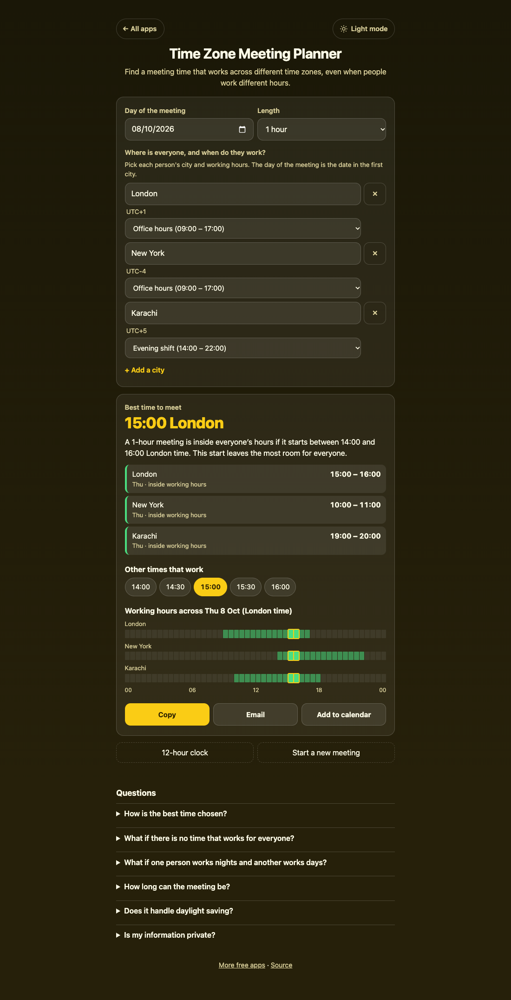

# Time Zone Meeting Planner

A free **meeting planner for people in different time zones**. Add everyone's city and when each person works (office hours, an evening shift, a night shift, or any hours you set), and it finds the best time to meet inside **everyone's own** working hours, with each person's local time and day. Daylight saving is handled by using each city's real clock on the day you pick. Copy the result, email it, or add it to your calendar. Works offline, no sign-up, no ads, nothing leaves your device.

**Live demo:** [umar8092.github.io/apps/time-zone-meeting-planner](https://umar8092.github.io/apps/time-zone-meeting-planner/)

| Desktop | On a phone |
|---|---|
|  |  |

## The situations it solves

**1. A team across three countries.** A lead in London needs a one-hour call on Thursday 8 October 2026 with colleagues in New York (office hours) and Karachi (an evening shift, 14:00 to 22:00). The app answers: **best time 15:00 London**, which is **10:00 in New York** and **19:00 in Karachi**, all on Thursday and all inside each person's hours. Starts from 14:00 to 16:00 London time also work.

**2. One person works days, another works nights.** A manager in London (9 to 5) and an engineer in New York on the night shift (10 pm to 6 am New York time). Their hours overlap for only two hours London time, and the app finds it: **09:30 London, which is 04:30 in New York**, inside both. With no shared hours at all (London days and Karachi nights) it says **no time works for everyone**, shows the closest option and who has to meet outside their hours, and for how long.

## Features

- **Help button.** Tap **Help** at the top for a short how-to written for this app, and tap **All apps** to go back to the list.
- **Working hours for every person**, not one shared window. Pick *Office hours*, *Early shift*, *Evening shift*, *Night shift*, *Any time*, or *Custom hours*. A custom shift that ends before it starts runs past midnight and the page says so.
- **Best time, not just a converter.** Tries every half hour and keeps only times where the whole meeting is inside everyone's hours, then picks the one with the most room for the person with the least.
- **Meeting length from 15 minutes to 3 hours**, or a **custom length** in minutes (3 hours is the most).
- **Each person's local time and day**, including "next day" and "previous day", and a note when it is a weekend somewhere.
- **Daylight saving** is correct for the chosen day, even when two places change their clocks on different dates.
- **Copy, email, calendar.** *Email* opens your mail app with the plan written (no recipient needed). *Add to calendar* saves a `.ics` file in UTC, so everyone sees it in their own time zone.
- **Start a new meeting** clears everything, with Undo. Your last plan is remembered on this device.
- **Light and dark mode switch** (it follows your device until you choose; the choice is remembered), 12 or 24-hour clock, and a **back to all apps** button.
- **Private, offline and installable.** Phone friendly, with no overlapping fields on small screens.

## Run it yourself

No build step and no dependencies.

```bash
git clone https://github.com/umar8092/apps.git
```

Then open `time-zone-meeting-planner/index.html` in your browser.

Offline mode and install need the files served over `https` or `localhost` (for example `python3 -m http.server`).

## How it works

- `core.js` is the maths, with no page code. Time zone rules come from the browser's built-in `Intl` database, so no data is downloaded. `plan()` tries every half hour of the day in the first city. Each person's hours are a window in minutes; a night shift is a window that ends past midnight.
- `script.js` builds the page. Typed text is added as plain text, never as HTML.
- `sw.js` saves the app on your device for offline use.
- Run the checks with `node tests.js` (hand-worked examples including night shifts), or open `test.html` in a browser. `ui-test.js` drives the real page.

## License

[MIT](LICENSE). Free to use, copy, modify and share. Made by [Muhammad Umar](https://github.com/umar8092).
