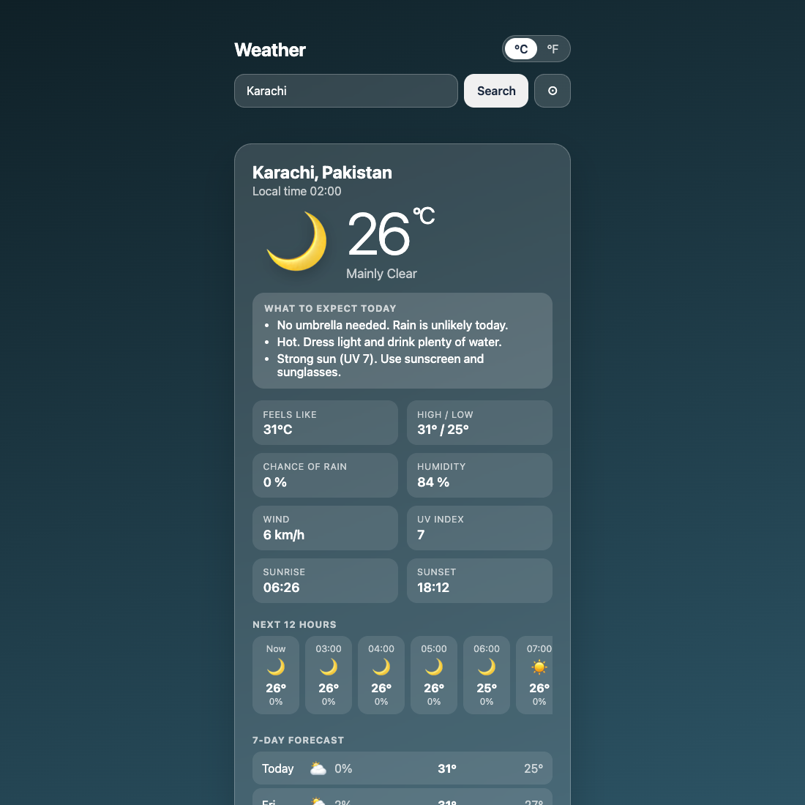

# Weather App

A free **weather forecast for any city or your current location**, with no sign-up and **no API key**. It tells you what to expect in plain words (take an umbrella? what to wear? is the sun strong?), then shows the details, the next 12 hours and the next 7 days.

**Live demo:** [umar8092.github.io/apps/weather-app](https://umar8092.github.io/apps/weather-app/)

| Desktop | On a phone |
|---|---|
|  |  |

The background changes with the weather and the time of day.

## The situation it solves

You are about to leave the house, or planning a trip, and want a quick answer: *Do I need an umbrella? A jacket? Sunscreen?* Weather App answers first, then shows the numbers:

- *No umbrella needed. Rain is unlikely today.*
- *Hot. Dress light and drink plenty of water.*
- *Strong sun (UV 7). Use sunscreen and sunglasses.*

## Features

- **Help button.** Tap **Help** at the top for a short how-to written for this app, and tap **All apps** to go back to the list.
- **Search any city.** Cities that share a name (Rome in Italy and Rome in Georgia) are handled: the best match is shown, with other real towns one tap away. Add a country to be exact, for example `Rome, IT`.
- **Use my location** with one tap. The browser asks permission first, and nothing is stored on a server.
- **Advice for today:** umbrella, what to wear for how it feels, strong sun, wind, snow and thunderstorm warnings.
- **Details:** feels like, high and low, chance of rain, humidity, wind, UV index, sunrise and sunset.
- **Next 12 hours** and a **7-day forecast** with a picture, chance of rain and high and low for each.
- **°C or °F**, switched instantly with no new request.
- **Remembers your place.** Open the app and your forecast is there.
- **Offline-friendly:** if you lose your connection it shows the last saved forecast and says when it was saved.
- Refreshes by itself when you come back to the tab after a while.
- **Back to all apps.** A "← All apps" button at the top of the page.

## No API key

Earlier versions needed a personal OpenWeatherMap key. This version uses [Open-Meteo](https://open-meteo.com) for weather and place search, which needs no key, and [BigDataCloud](https://www.bigdatacloud.com) only to turn your position into a place name when you tap "use my location" (if that fails, the forecast still works). The free Open-Meteo service is for non-commercial use, which fits this ad-free app. An old key saved in your browser by the earlier version is removed automatically.

## Run it yourself

No build step and no dependencies.

```bash
git clone https://github.com/umar8092/apps.git
cd apps/weather-app
python3 -m http.server
```

Then open http://localhost:8000 (the location button needs `https` or `localhost`).

## How it works

- `core.js` is the logic with no page code: weather codes to words and pictures, the advice rules, place search matching, and the next-hours list. Values stay in metric and are converted for display.
- `script.js` builds the page. All place names and text are added as plain text, never as HTML.
- Run the checks with `node tests.js`, or open `test.html` in a browser.

## License

[MIT](LICENSE). Free to use, copy, modify and share. Made by [Muhammad Umar](https://github.com/umar8092). Weather data by Open-Meteo.com (CC BY 4.0).
