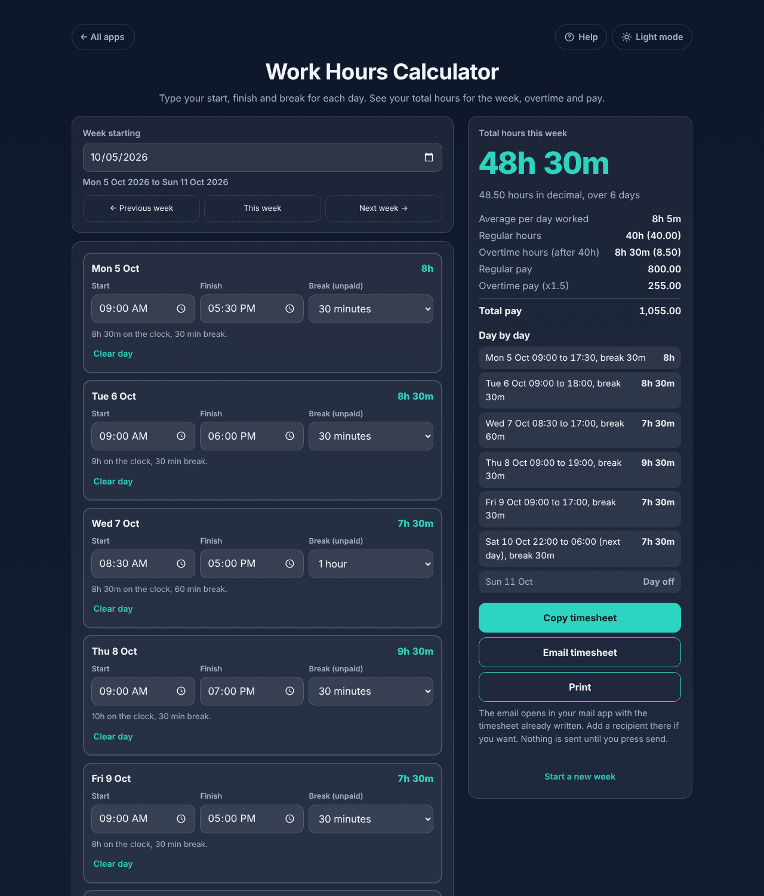

# Work Hours Calculator

A free **weekly timesheet and work hours calculator**. Type your start, finish and break for each day and it tells you your total hours for the week, in hours and minutes and in decimal, plus overtime and pay if you want them. Night shifts that run past midnight work, and every day has its own break. Works offline, no sign-up, no ads. No currency is shown, so it works in any country.

**Live demo:** [umar8092.github.io/apps/work-hours-calculator](https://umar8092.github.io/apps/work-hours-calculator/)

| Desktop | On a phone |
|---|---|
|  |  |

## The situation it solves

An employee needs to fill in a timesheet, or check their pay, and works out of a pile of start and finish times. Example week:

| Day | Start | Finish | Break | Hours |
|---|---|---|---|---|
| Mon | 09:00 | 17:30 | 30 min | 8h |
| Tue | 09:00 | 18:00 | 30 min | 8h 30m |
| Wed | 08:30 | 17:00 | 60 min | 7h 30m |
| Thu | 09:00 | 19:00 | 30 min | 9h 30m |
| Fri | 09:00 | 17:00 | 30 min | 7h 30m |
| Sat | 22:00 | 06:00 (next day) | 30 min | 7h 30m |

The answer: **48h 30m (48.50 hours) over 6 days.** With overtime after 40 hours at 20.00 per hour and overtime paid at 1.5 times: 40h regular = 800.00, 8h 30m overtime = 255.00, **total pay 1,055.00**.

Other cases it handles: a finish earlier than the start (shift past midnight), start equal to finish (counted as 0 and flagged), a break longer than the shift (0 and flagged), empty days (day off), rounding to 5, 10, 15 or 30 minutes, and money kept in whole cents so pay is exact.

## Features

- **Help button.** Tap **Help** at the top for a short how-to, and **All apps** to go back to the list.
- **Each day has its own start, finish and break** (presets or any number of minutes).
- **Total hours** in hours and minutes and in decimal, days worked and average per day.
- **Overtime, pay and rounding** are optional and hidden behind *+ Add overtime, pay and rounding*. Overtime limit and multiplier have presets and a custom option.
- **Week by week.** Pick any week, go to the previous or next one. Each week is saved on your device.
- **Fill the week** with the same hours for Monday to Friday or all 7 days.
- **Copy, email or print** the timesheet. Email opens your mail app with the text written and no recipient needed. Nothing is sent by the app.
- **Start a new week** clears the week, with Undo.
- **Private.** Everything is worked out on your device.
- **Works offline and installable.** Light and dark mode switch, phone and desktop layouts.

## Run it yourself

No build step and no dependencies.

```bash
git clone https://github.com/umar8092/apps.git
```

Then open `work-hours-calculator/index.html` in your browser. Offline mode and install need the files served over `https` or `localhost` (for example `python3 -m http.server`).

## How it works

- `core.js` is the maths, with no page code. Times are minutes, money is whole cents.
- `script.js` builds the page. Text is added as plain text, never as HTML.
- `sw.js` saves the app for offline use (network first, so updates always arrive).
- Checks: `node tests.js` for the maths, `node ui-test.js` drives the real page in headless Chromium.

## License

[MIT](LICENSE). Free to use, copy, modify and share. Made by [Muhammad Umar](https://github.com/umar8092).
